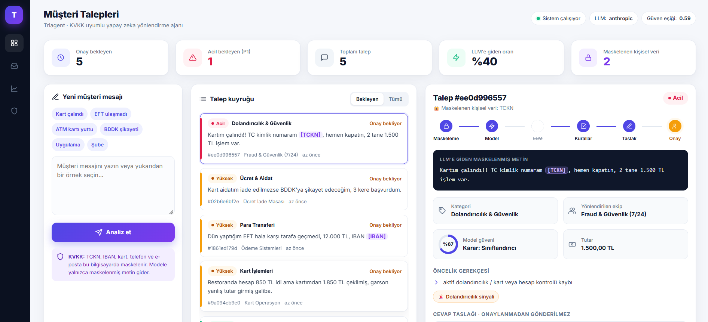
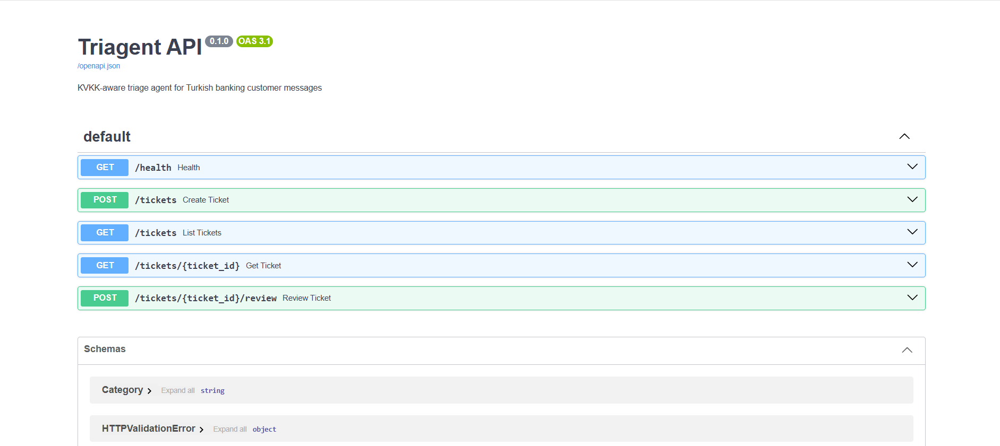
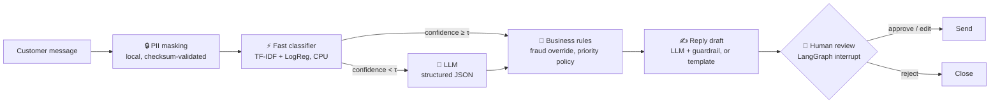
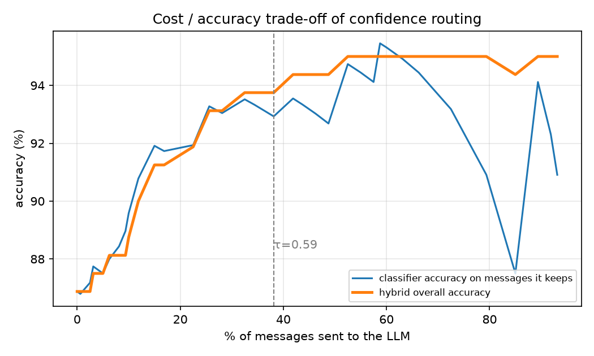
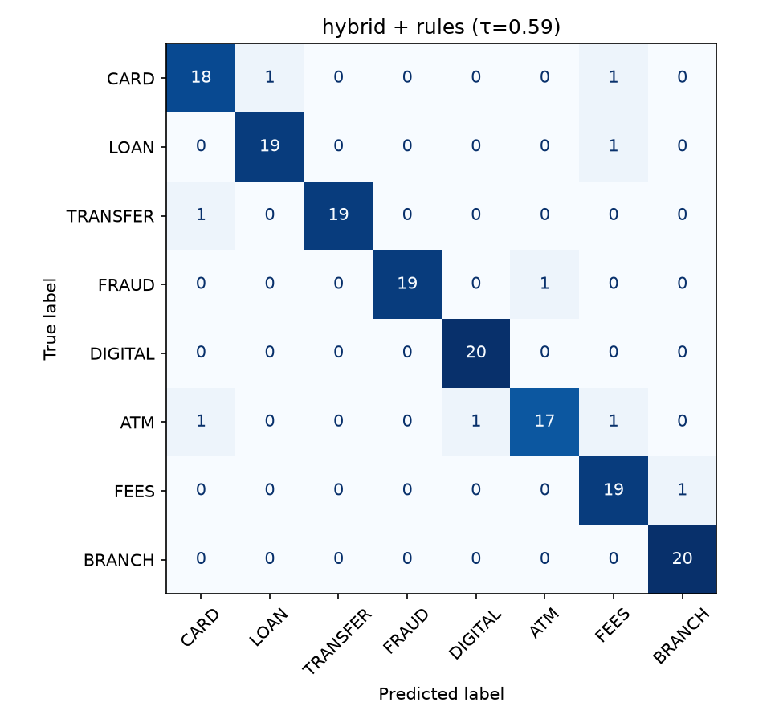

<div align="center">

# 🏦 Triagent

### KVKK-aware AI triage agent for Turkish banking customer messages

*Masks personal data locally · classifies & prioritises · drafts replies · a human always approves*




<sub>A stolen-card report is masked, flagged as <b>urgent</b>, routed to the fraud team and waits for agent approval.</sub>

</div>

---

## ✨ Highlights

- 🔒 **KVKK-first:** T.C. Kimlik No, IBAN, card numbers, phones and e-mails are masked **on the local machine** before any model sees the text. Every number is checked with its own algorithm (TCKN check digits, IBAN mod-97, Luhn), so order and reference numbers are not masked by mistake.
- ⚡ **Hybrid routing:** a CPU-only classifier answers in **< 1 ms**; only messages it is unsure about go to the LLM. Result: **94.4% accuracy** (LLM-only: 95.0%) with **61% fewer LLM calls** and **2.5× lower latency**.
- 🛡️ **Rules where mistakes are expensive:** transparent business rules catch fraud, stuck funds and legal threats, and keep working when the LLM is unavailable.
- 👤 **Human in the loop:** the LangGraph workflow pauses before any reply is sent. An agent approves, edits or rejects it.

## 💡 Why this project

Turkish banks, telecoms and e-commerce companies receive thousands of customer messages a day. Two problems come up again and again:

1. **Routing is manual and slow.** A stolen-card report can wait in the same queue as a question about branch opening hours.
2. **Messages are full of personal data.** T.C. Kimlik No, IBAN and card numbers cannot simply be sent to a third-party LLM API under **KVKK** (Turkey's personal data protection law).

Triagent is a working prototype of how an LLM can be used safely in this setting: **cheap where possible, careful where it matters, and always with a human in the loop.**

## 🖥️ Demo

| Web console (frontend) | REST API (backend) |
|:---:|:---:|
|  |  |
| Queue sorted by urgency, masked text, pipeline steps, model confidence, priority reasons and an editable reply draft. | FastAPI with automatic OpenAPI docs at `/docs`. The console only talks to this API, so a CRM or mobile app could use the same endpoints. |

## ⚙️ How it works



| Step | What happens | Why |
|---|---|---|
| **1. PII masking** | T.C. Kimlik No (official check digits), TR IBAN (mod-97), card numbers (issuer prefix + Luhn), mobile numbers and e-mails are replaced by tokens like `[TCKN]` **before** any model sees the text. | KVKK. Checksum validation keeps order and reference numbers from being masked by mistake. |
| **2. Fast classifier** | TF-IDF (word + character n-grams) + Logistic Regression. Runs in **< 1 ms on CPU**. | Most messages are easy. Paying for an LLM call on every message is wasteful. |
| **3. Confidence routing** | Only messages below the threshold τ go to the LLM. τ is chosen by **5-fold cross-validation on the training set**, never on the test set. | Lets you trade cost against accuracy with one number. |
| **4. Business rules** | Transparent rules catch active fraud (*"kartım çalındı"*, *"bilgim dışında"*), stuck funds, BDDK / legal threats, financial hardship and vulnerable customers. | Missing a fraud case is far more expensive than any other error, so it should not depend on a probabilistic model alone. When the LLM and the rules disagree on priority, **the more urgent one wins**. |
| **5. Reply draft** | The LLM writes a polite Turkish draft. A guardrail blocks drafts that contain personal data, ask for passwords or OTP codes, or promise refunds. Blocked drafts fall back to approved templates. | Banking is regulated. The model must never ask for credentials or make promises. |
| **6. Human review** | The LangGraph run **pauses** (`interrupt`) and is checkpointed in SQLite. It resumes when an agent approves, edits or rejects the draft. | No customer-facing text without human approval. |

**Categories:** Card · Loan · Transfer (EFT/FAST/Havale) · Fraud & Security · Mobile/Internet Banking · ATM · Fees · Branch & Call Center
**Priorities:** 🔴 P1 Urgent · 🟠 P2 High · 🟢 P3 Normal
**Flags:** fraud signal · legal/regulator threat · financial hardship · churn risk · vulnerable customer

## 📊 Results

Held-out test set of **160 messages** (20 per category), written separately from the training data and never used for training, rule writing or threshold selection. LLM: **Claude Sonnet 4.6**.

| System | Accuracy | Macro-F1 | FRAUD recall | Priority acc. | P1 recall | LLM calls | Latency / msg |
|---|:---:|:---:|:---:|:---:|:---:|:---:|:---:|
| Classifier only (TF-IDF) | 86.9% | 0.868 | 90.0% | 80.6% | 88.2% | 0% | < 1 ms |
| Classifier + rules (offline mode) | 87.5% | 0.875 | 95.0% | 91.9% | 94.1% | 0% | < 1 ms |
| LLM only | 95.0% | 0.950 | 100% | 91.2% | 100% | 100% | 2.76 s |
| **Hybrid + rules (Triagent)** | **94.4%** | **0.944** | **95.0%** | **91.2%** | **94.1%** | **39%** | **1.09 s** |

**Key result:** the hybrid system gets within 0.6 points of LLM-only accuracy while sending only **39% of messages** to the LLM, cutting LLM calls by **61%** and average latency by **2.5×**.
**The trade-off:** LLM-only catches every fraud and urgent case on this test set; the hybrid misses one of each. A bank that wants zero misses can raise τ and send more messages to the LLM; the threshold curve below shows the full cost/accuracy trade-off.
Rules alone (no LLM) raise fraud recall from 90% to 95% at zero cost, so the system stays useful even when the LLM is unavailable.

**PII masking.** Benchmark of 400 synthetic sentences that mix valid identifiers with look-alike decoys: order numbers, 16-digit references, customer numbers, amounts and dates.

| Type | Precision | Recall |
|---|:---:|:---:|
| T.C. Kimlik No | 100% | 100% |
| IBAN | 100% | 100% |
| Card number | 96.2% | 100% |
| Phone | 100% | 100% |
| E-mail | 100% | 100% |

Card precision is not 100% because a random 16-digit reference number passes the Luhn check about 1 time in 10. Context words (e.g. *"referans"*, *"sipariş"*) would fix it.

<p align="center">


</p>

**Error analysis.** Most classifier mistakes sit on real category boundaries, for example *"fee charged at another bank's ATM"* (ATM or Fees?) or *"paying my credit card debt in 12 installments"* (Card or Loan?). Most of them have low classifier confidence (< τ), so in hybrid mode they are sent to the LLM.

## 🧰 Tech stack

| Layer | Tools |
|---|---|
| Agent workflow | **LangGraph** (conditional routing, `interrupt` for human review, SQLite checkpointing) |
| Machine learning | **scikit-learn** (TF-IDF + Logistic Regression), optional multilingual-e5 embeddings |
| LLM | **Claude** (Anthropic) or any OpenAI-compatible API: Gemini, Groq, Ollama, OpenAI · **Pydantic**-validated JSON output |
| Backend | **FastAPI** + Uvicorn, SQLite |
| Frontend | Single-page web console (HTML + JavaScript, no build step), alternative Streamlit panel |
| Quality | pytest, ruff, **GitHub Actions** CI |

## 🚀 Quick start

Needs Python 3.10+. **No GPU.**

```bash
git clone https://github.com/MuhammetDikmetas/triagent-turkish-banking.git
cd triagent-turkish-banking
python -m venv .venv
# Windows: .venv\Scripts\activate      macOS/Linux: source .venv/bin/activate
pip install -e ".[dev]"

python scripts/build_dataset.py   # data/raw -> data/processed (fake but valid PII injected)
python scripts/train.py           # trains the classifier, picks τ with cross-validation
pytest -q                         # runs the test suite

uvicorn triagent.api:app --reload # web console -> http://localhost:8000 · API docs -> /docs
```

Without an API key the system runs in **offline mode** (classifier + rules + template replies). An alternative Streamlit console is also included: `streamlit run app/panel.py`.

**Using an LLM (optional).** Copy `.env.example` to `.env` and set a provider and key. Every provider is reached through its OpenAI-compatible endpoint, so switching is a one-line change.

| `LLM_PROVIDER` | Default model | Notes |
|---|---|---|
| `anthropic` | Claude Sonnet 4.6 | Used for the results above |
| `gemini` | Gemini Flash | Free tier at [aistudio.google.com](https://aistudio.google.com) |
| `groq` | Llama 3.3 70B | Free tier at [console.groq.com](https://console.groq.com) |
| `ollama` | Qwen 2.5 3B | Fully local, no key |
| `openai` | GPT-4o mini | Paid |
| `none` | — | **Offline mode** |

Then run `python eval/run_eval.py` to reproduce the results table. LLM responses are cached on disk, so re-runs are free. The `.env` file is git-ignored, so keys never reach the repository.

**REST API example**

```bash
curl -X POST localhost:8000/tickets -H "Content-Type: application/json" \
     -d '{"text": "Kartım çalındı, TC 10000000146, hemen kapatın"}'
curl -X POST localhost:8000/tickets/<id>/review -H "Content-Type: application/json" \
     -d '{"action": "approve"}'
```

## 📁 Project structure

```
triagent-turkish-banking/
├── src/triagent/
│   ├── pii.py          # KVKK masking: TCKN / IBAN / Luhn validators
│   ├── classifier.py   # TF-IDF or e5 encoder + Logistic Regression
│   ├── rules.py        # fraud override, priority policy, customer flags
│   ├── llm.py          # OpenAI-compatible client, Pydantic-validated JSON, disk cache
│   ├── prompts.py      # prompts kept in one reviewable place
│   ├── replies.py      # reply templates + output guardrail
│   ├── graph.py        # LangGraph workflow with human-in-the-loop interrupt
│   ├── service.py      # mask -> run graph -> persist (shared by API and UI)
│   └── api.py          # FastAPI backend, also serves the web console
├── web/index.html      # web console (HTML + JS, no build step)
├── app/panel.py        # alternative Streamlit console
├── data/raw/           # labelled messages (train 364, test 160)
├── scripts/            # build_dataset.py, train.py
├── eval/               # run_eval.py + results (metrics, charts)
├── docs/               # screenshots
└── tests/              # PII, rules, graph, API (fake LLM, runs offline in CI)
```

## 🗂️ Data

Real bank complaint data is not public, for KVKK reasons. The messages in `data/raw/` are **synthetic**: written with LLM assistance to cover different customer styles (formal, angry, no Turkish characters, typos, long and short) and then labelled. The test set was written separately, with longer and more ambiguous messages, to avoid near-duplicates of training data (a similarity check found 0 test messages with > 80% similarity to any training message). Identifiers are generated to be checksum-valid but belong to no one.

## 🔭 Limitations & next steps

- **Synthetic data.** Numbers measured on real tickets will be lower. Because the test set was LLM-assisted, the LLM rows may be somewhat optimistic. The first step in production is to re-label a sample of real messages.
- **Names and addresses are not masked.** Masking them needs a Turkish NER model.
- **Rules are hand-written.** They are auditable, but need periodic review against missed cases.
- **Next steps:** learn from agent corrections (active learning), fine-tune a small Turkish encoder, run the LLM on-premise, add monitoring for drift and LLM cost.

## 📄 License

MIT. Built by [Muhammet Dikmetaş](https://github.com/MuhammetDikmetas) · [LinkedIn](https://www.linkedin.com/in/muhammet-dikmeta%C5%9F-3b55b7252/)